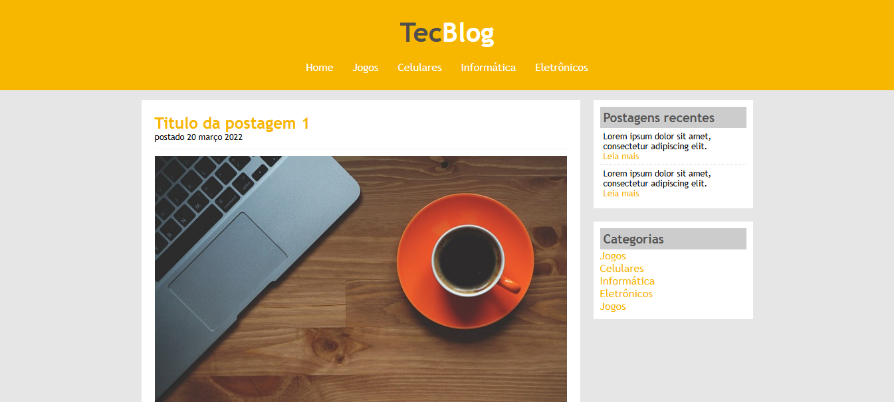

<h2 id="tecblog">1. 💻 TecBlog: O seu Blog de Tecnologia 💻</h2>


[](https://github.com/Domisnnet/tecblog/blob/main/LICENSE)



Bem-vindo ao **TecBlog**! Este projeto consiste na criação de um blog de tecnologia com um layout limpo e funcional. Ele explora a organização de conteúdos em feeds de notícias, utilizando uma barra lateral para navegação rápida entre categorias e postagens recentes. É um excelente estudo de como gerenciar áreas de cabeçalho dinâmicas e containers de conteúdo principal.

---

## 📚 Tabela de Conteúdo

| 📍 O Projeto | 🛠️ Desenvolvimento | 💬 Suporte & Info |
| :---: | :---: | :---: |
| [](#sobre) | [](#tecnologias-utilizadas) | [](#codigo-fonte) |
| [](#acesse-a-aplicacao) | [](#como-contribuir) | [](#creditos) |
| [](#sobre) | [](#instalacao-local) | [](#licenca) |
| [](#como-usar) | [](#perguntas-frequentes) | [](#perfil-do-github) |

---

<h2 id="acesse-a-aplicacao">2. 🔗 Acesse a Aplicação</h2>

Navegue pelas notícias de tecnologia do TecBlog clicando no botão abaixo:

<a href="https://domisnnet.github.io/Tecblog/" target="_blank">
  
</a>

---

<h2 id="sobre">3. 🚀 Sobre a Aplicação</h2> 

O **TecBlog** é uma aplicação web de interface clássica focada na experiência de leitura. O projeto demonstra o domínio de estruturação HTML semântica e estilização CSS para criar um layout com área principal de postagens e uma barra lateral de navegação (sidebar), garantindo uma hierarquia visual clara para o usuário.

---

<h2 id="como-usar">4. 🎮 Como Usar</h2>

1.  **Acesse o link:** Utilize o botão na seção 2 para abrir o blog.
2.  **Navegação:** Use o menu superior para filtrar por categorias (Jogos, Celulares, etc).
3.  **Leitura:** Clique nos títulos das postagens para ler o conteúdo completo.
4.  **Sidebar:** Acompanhe as postagens recentes e links úteis na barra à direita.

---

<h2 id="tecnologias-utilizadas">5. ⚙️ Tecnologias Utilizadas</h2>

| Camada | Tecnologias | Descrição |
| :--- | :--- | :--- |
| **Estrutura** |  | Marcação estruturada para posts, datas e links de navegação. |
| **Estilo** |  | Design personalizado com foco em containers centralizados e sidebar. |
| **Identidade** |  | Paleta de cores moderna focada em legibilidade e contraste. |

---

<h2 id="como-contribuir">6. 🤝 Como Contribuir</h2>

Ajude a evoluir o TecBlog! Siga os passos abaixo para contribuir:

| Fase | Ação | Link / Comando |
| :---: | :--- | :--- |
| **01** | **Prepare o Terreno** | [](https://github.com/Domisnnet/tecblog/fork) |
| **02** | **Crie uma Branch** | `git checkout -b feature/NovaMelhoria` |
| **03** | **Guarde as Mudanças** | `git commit -m 'feat: Adiciona nova funcionalidade'` |
| **04** | **Envie o Código** | `git push origin feature/NovaMelhoria` |
| **05** | **Desafio Final** | [](https://github.com/Domisnnet/tecblog/compare) |

### 🐛 Encontrou um problema?
Se algo não estiver funcionando como esperado, não hesite em abrir um chamado:

[](https://github.com/Domisnnet/Tecblog/issues)
[](https://github.com/Domisnnet/Tecblog/issues/new)

---

<h2 id="instalacao-local">7. 🚀 Instalação e Configuração Local</h2>

```bash
# Clonar o repositório
git clone [https://github.com/Domisnnet/tecblog.git](https://github.com/Domisnnet/tecblog.git)

# Acessar a pasta
cd tecblog

# Executar
# Abra o arquivo index.html no seu navegador.
```
---

<h2 id="perguntas-frequentes">8. 🤔 Perguntas Frequentes</h2>

<details>
<summary><strong>Como adicionar uma nova postagem ❓</strong></summary>
<p>✍️ <strong>Resposta:</strong> Basta copiar a estrutura da classe <code>postagem</code> no HTML e preencher com seu novo conteúdo.</p>
</details>

<details>
<summary><strong>O site é responsivo ❓</strong></summary>
<p>📱 <strong>Resposta:</strong> Atualmente o layout é fixo para desktop. Uma ótima melhoria futura seria a implementação de media queries para dispositivos móveis.</p>
</details>

<details>
<summary><strong>Posso usar este código como base para meu blog ❓</strong></summary>
<p>✅ <strong>Com certeza!</strong> O projeto está sob licença MIT, então sinta-se livre para clonar, adaptar e utilizar como quiser. Só não se esqueça de dar os devidos Créditos!!</p>
</details>

---

<h2 id="codigo-fonte">9. 💻 Código Fonte</h2>

Gostou da estrutura? Para ver o código-fonte detalhado e contribuir com o projeto, acesse:

[](https://github.com/Domisnnet/Tecblog)

---

<h2 id="creditos">10. 📝 Créditos</h2>

O **TecBlog** foi desenvolvido como parte de um estudo aprofundado sobre CSS e arquitetura web:

| Atribuição | Responsável | Descrição |
| :--- | :--- | :--- |
| **Dev & Design** | **DomisDev** | Desenvolvimento front-end e estilização. |
| **Mentoria** | **Mega Sênior** | Padronização de documentação e melhores práticas. |

---

<h2 id="licenca">11. 📄 Licença</h2>

Este projeto é *open source* e está licenciado sob a [](https://github.com/Domisnnet/Tecblog/blob/main/LICENSE)

---

<h2 id="perfil-do-github">12. 👨‍💻 Perfil do GitHub</h2>

Clique na imagem abaixo para conferir outros projetos no meu perfil:

<a href="https://github.com/Domisnnet"> 
   
</a>